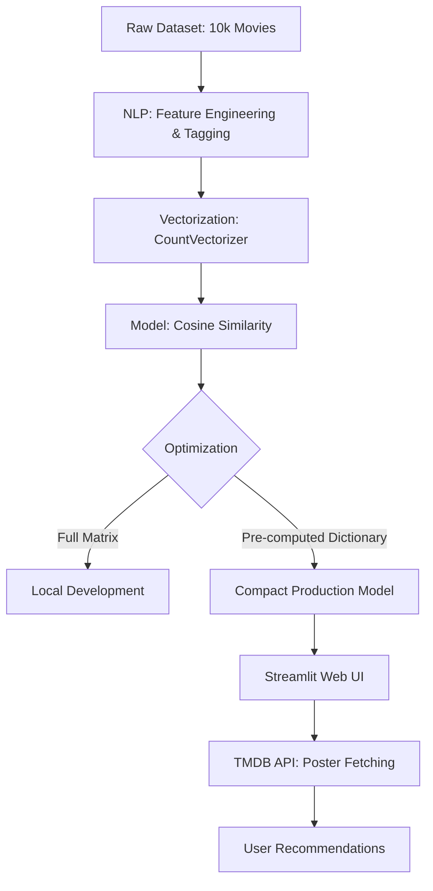

# 🎬 Movie Recommender System

### 🚀 [View Live App](https://movie-recom-dp.streamlit.app/)

A content-based movie recommendation system built with **Python**, **Scikit-learn**, and **Streamlit** that recommends similar movies using genres and plot metadata. The project is optimized for deployment using a **compact similarity model** that delivers fast recommendations with low memory usage.

---

## 📌 Project Overview

This project is a comprehensive **Content-Based Movie Recommendation System** designed to provide users with personalized movie suggestions. By leveraging **Natural Language Processing (NLP)** and **vector space modeling**, the system analyzes movie metadata such as genres and plot overviews to identify and recommend films with high thematic and structural similarity.

---

## 🏗️ Technical Architecture

The following diagram illustrates the complete flow from raw movie data to the final recommendation shown to the user:



---

## ✨ Features

- Content-based movie recommendations
- NLP-powered feature engineering
- Tag creation using genres and movie overviews
- Text vectorization using `CountVectorizer`
- Similarity matching with cosine similarity
- Compact top-neighbor recommendation model for deployment
- Streamlit web app with a Netflix-style dark theme
- Real-time poster fetching using the TMDB API
- "Trending Now" section for movie discovery

---

## ⚙️ Implementation Details

### 1. Data Engineering & Model Training (`main.ipynb`)

- Processed a dataset of **10,000 movies**
- Extracted important features such as:
  - `id`
  - `title`
  - `genre`
  - `overview`
- Created a unified **tags** column by merging genres and plot summaries
- Converted text data into numerical feature vectors using **CountVectorizer**
- Computed pairwise movie similarity using **Cosine Similarity**

### 2. The Innovation: Compact Model Strategy

To make the application responsive and deployment-friendly, the project uses a **dual-model strategy**:

#### Local Analysis
- Generated a full similarity matrix for local validation and testing
- Used the full matrix for deep analysis during development

#### Production Optimization
- Built a compact dictionary containing only the **top 6 nearest neighbors** for each movie
- Avoided loading a large \(N \times N\) similarity matrix on the live server
- Reduced memory usage significantly
- Achieved **sub-second recommendation response times**

### 3. Web Application Deployment (`app.py`)

- Developed a high-performance UI using **Streamlit**
- Applied a custom **Netflix-style dark theme**
- Integrated the **TMDB API** for dynamic movie poster fetching
- Added a **Trending Now** gallery using randomized sampling
- Combined search-based recommendation with discovery-driven browsing

---

## 📈 Business & User Impact

- **Enhanced engagement:** Reduces choice fatigue by instantly surfacing relevant movies
- **Operational efficiency:** Demonstrates a cost-effective ML deployment strategy
- **Scalable UX:** Supports both targeted recommendation and content discovery

---

## 🛠️ Tech Stack

- **Python**
- **Pandas**
- **Scikit-learn**
- **Streamlit**
- **Requests**
- **TMDB API**

---

## 🚀 Installation & Local Setup

### 1. Clone the repository

```bash
git clone https://github.com/your-username/movie-recommender.git
cd movie-recommender
```

### 2. Install dependencies

```bash
pip install streamlit pandas requests scikit-learn
```

### 3. Run the application

```bash
streamlit run app.py
```

---

## 📂 Project Structure

```bash
movie-recommender/
│── app.py
│── main.ipynb
│── movies.pkl
│── similarity.pkl
│── README.md
```

---

## 🧠 How It Works

1. Movie metadata is collected and cleaned
2. Genres and overviews are merged into a single text column called `tags`
3. `CountVectorizer` transforms the text into vectors
4. Cosine similarity measures how close movies are to one another
5. A compact top-neighbor dictionary is used in production
6. The app fetches posters in real time using the TMDB API

---

## 📷 Project Gallery

1.  **Screenshots**

    

    

    

    

    

    

2. **Videos**

  https://github.com/user-attachments/assets/b80ad1a0-678f-4d1d-a49b-ee9f4f3606f2


---

## 🔮 Future Improvements

- Add movie search autocomplete
- Improve recommendation quality with advanced NLP
- Add filtering by genre, language, or year
- Store compact similarity results in a database
- Containerize the project using Docker

---

## 🤝 Contributing

Contributions, feedback, and suggestions are welcome. Feel free to fork the repository and open a pull request.

---

## 👨‍💻 Author

**Dipanshu Parashar**  
[GitHub Profile](https://github.com/dipanshuparashar902)


